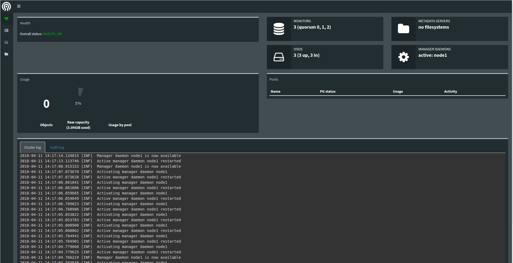

# Ceph Luminous(12.2.4) 部署

* [0.准备集群](#0准备集群)
* [1.环境预检](#1环境预检)
* [2.搭建集群](#2搭建集群)
* [3.Dashboard配置](#3dashboard配置)
* [4.pool创建及使用](#4pool创建及使用)
* [参考资料](#参考资料)

## 0.准备集群

vm: 3台 CentOS-7.2-x64(3.10.0-693.5.2.el7.x86\_64) 1核, 1G Mem, 20G SSD x 2

subnet: 10.0.4.0/26

主机  | IP                                            | 功能
----- | --------------------------------------------- | ----------------------------
node1 | 10.0.4.14(内网), 192.168.20.52 100Mbps (公网) | ceph-deploy, mon, mgr, osd
node2 | 10.0.4.6 (内网), 192.168.20.59 100Mbps (公网) | mon, osd
node3 | 10.0.4.15(内网), 192.168.20.58 100Mbps (公网) | mon, osd

1) **修改主机名(所有节点)**，参考 [如何在CentOS 7上修改主机名](https://www.jianshu.com/p/39d7000dfa47)

```sh
[root@node{1,2,3} ~]# hostnamectl set-hostname node1
[root@node{1,2,3} ~]# hostnamectl --pretty

[root@node{1,2,3} ~]# hostnamectl --static
node1
[root@node{1,2,3} ~]# hostnamectl --transient
node1
[root@node{1,2,3} ~]# cat /etc/hosts
...
127.0.0.1 node1
```

2) **创建用户**，参考 [CREATE A CEPH DEPLOY USER](http://docs.ceph.com/docs/master/start/quick-start-preflight/#create-a-ceph-deploy-user)

```sh
[root@node{1,2,3} ~]# sudo useradd -d /home/search -m search    # search 用户
[root@node{1,2,3} ~]# sudo passwd search
[root@node{1,2,3} ~]# echo "search ALL = (root) NOPASSWD:ALL" | sudo tee /etc/sudoers.d/search
search ALL = (root) NOPASSWD:ALL
[root@node{1,2,3} ~]# sudo chmod 0440 /etc/sudoers.d/search
```

3) **实现SSH无密登陆**，参考 [ENABLE PASSWORD-LESS SSH](http://docs.ceph.com/docs/master/start/quick-start-preflight/#create-a-ceph-deploy-user)

```sh
[root@node1 ~]# su search
[search@node1 ~]$ cat ~/.ssh/config
#~/.ssh/config

Host node2
    Hostname 10.0.4.6
    User search

Host node3
    Hostname 10.0.4.15
    User search

[search@node1 ~]$ chmod 0600 ~/.ssh/config
[search@node1 ~]$ ssh-copy-id search@node2
[search@node1 ~]$ ssh-copy-id search@node3
```

## 1.环境预检

TODO: 防火墙设置

1) 配置ntp服务，参考 [CEPH NODE SETUP](http://docs.ceph.com/docs/master/start/quick-start-preflight/#ceph-node-setup)

```sh
[search@node{1,2,3} ~]$ sudo yum install ntp ntpdate -y
[search@node{1,2,3} ~]$ sudo ntpdate pool.ntp.org
[search@node{1,2,3} ~]$ sudo systemctl enable ntpd.service
[search@node{1,2,3} ~]$ sudo systemctl enable ntpdate.service
[search@node{1,2,3} ~]$ sudo systemctl start ntpd.service
```

2) [PRIORITIES/PREFERENCES](http://docs.ceph.com/docs/master/start/quick-start-preflight/#priorities-preferences)

```sh
[search@node{1,2,3} ~]$ sudo yum install yum-plugin-priorities -y
```

3) 配置源，参考 [RPM PACKAGES](http://docs.ceph.com/docs/master/install/get-packages/#rpm-packages), [INSTALLING WITH RPM](http://docs.ceph.com/docs/master/install/install-storage-cluster/)

```sh
[search@node{1,2,3} ~]$ cat /etc/yum.repos.d/ceph.repo
[ceph]
name=Ceph packages for $basearch
# luminous, centos7
baseurl=https://download.ceph.com/rpm-luminous/el7/$basearch
enabled=1
priority=2
gpgcheck=1
gpgkey=https://download.ceph.com/keys/release.asc

[ceph-noarch]
name=Ceph noarch packages
baseurl=https://download.ceph.com/rpm-luminous/el7/noarch
enabled=1
priority=2
gpgcheck=1
gpgkey=https://download.ceph.com/keys/release.asc

[ceph-source]
name=Ceph source packages
baseurl=https://download.ceph.com/rpm-luminous/el7/SRPMS
enabled=0
priority=2
gpgcheck=1
gpgkey=https://download.ceph.com/keys/release.asc
```

3) 更新源，安装依赖

```sh
[search@node{1,2,3} ~]$ sudo yum makecache
[search@node{1,2,3} ~]$ sudo yum update -y
[search@node{1,2,3} ~]$ sudo yum install snappy leveldb gdisk python-argparse gperftools-libs -y
```

4) 安装ceph-deploy(node1)，参考 [INSTALL CEPH DEPLOY](http://docs.ceph.com/docs/master/install/install-ceph-deploy/)

```sh
[search@node1 ~]$ sudo yum install -y ceph-deploy
[search@node1 ~]$ ceph-deploy --version
2.0.0
```

## 2.搭建集群

1) 创建集群操作目录

```sh
[search@node1 ~]$ mkdir my-cluster
[search@node1 ~]$ cd my-cluster
```

2) 创建集群，参考 [CREATE A CLUSTER](http://docs.ceph.com/docs/master/start/quick-ceph-deploy/)

```sh
[search@node1 my-cluster]$ cat /etc/hosts    # 配置node1 /etc/hosts
...
10.0.4.14       node1
10.0.4.6        node2
10.0.4.15       node3

[search@node1 my-cluster]$ ceph-deploy new node1 node2 node3
[search@node1 my-cluster]$ ls
ceph.conf  ceph-deploy-ceph.log  ceph.mon.keyring

[search@node1 my-cluster]$ cat ceph.conf     # 修改配置，添加public network
[global]
fsid = 57e12384-fd45-422b-bd0a-49da4149c1da
mon_initial_members = node1, node2, node3
mon_host = 10.0.4.14,10.0.4.6,10.0.4.15
auth_cluster_required = cephx
auth_service_required = cephx
auth_client_required = cephx
public network = 10.0.4.0/26        # add
```

3) 安装ceph luminous(12.2.4)，参考 [CREATE A CLUSTER](http://docs.ceph.com/docs/master/start/quick-ceph-deploy/)

```sh
[search@node1 my-cluster]$ ceph-deploy install --release luminous node1 node2 node3
```

由于网速慢原因，安装可能会失败，我们可自行在各个节点手动安装 ceph

```sh
[search@node{1,2,3} ~]$ sudo yum install -y epel-release 
[search@node{1,2,3} ~]$ sudo yum install -y ceph ceph-radosgw

[search@node1 ~]$ ceph --version
ceph version 12.2.4 (52085d5249a80c5f5121a76d6288429f35e4e77b) luminous (stable)

[search@node2 ~]$ ceph --version
ceph version 12.2.4 (52085d5249a80c5f5121a76d6288429f35e4e77b) luminous (stable)

[search@node3 ~]$ ceph --version
ceph version 12.2.4 (52085d5249a80c5f5121a76d6288429f35e4e77b) luminous (stable)
```

4) 初始化 mon，参考 [CREATE A CLUSTER](http://docs.ceph.com/docs/master/start/quick-ceph-deploy/)

```sh
[search@node1 my-cluster]$ ceph-deploy mon create-initial
[search@node1 my-cluster]$ ls
ceph.bootstrap-mds.keyring  ceph.bootstrap-osd.keyring  ceph.client.admin.keyring  ceph-deploy-ceph.log
ceph.bootstrap-mgr.keyring  ceph.bootstrap-rgw.keyring  ceph.conf                  ceph.mon.keyring
```

5) 赋予各个节点使用命令免用户名权限

```sh
[search@node1 my-cluster]$ ceph-deploy admin node1 node2 node3
```

6) 部署mgr(luminus+)

```sh
[search@node1 my-cluster]$ ceph-deploy mgr create node1
```

7) 添加osd，参考 [CREATE A CLUSTER](http://docs.ceph.com/docs/master/start/quick-ceph-deploy/)

```sh
[search@node{1,2,3} ~]$ sudo fdisk -l       # 每台 vm 均挂载 2块 20G SSD
Disk /dev/sda: 21.5 GB, 21474836480 bytes, 41943040 sectors
Units = sectors of 1 * 512 = 512 bytes
Sector size (logical/physical): 512 bytes / 512 bytes
I/O size (minimum/optimal): 512 bytes / 512 bytes
Disk label type: dos
Disk identifier: 0x000b467e

Device Boot      Start         End      Blocks   Id  System
/dev/sda1   *        2048    41943006    20970479+  83  Linux

Disk /dev/sdb: 21.5 GB, 21474836480 bytes, 41943040 sectors
Units = sectors of 1 * 512 = 512 bytes
Sector size (logical/physical): 512 bytes / 512 bytes
I/O size (minimum/optimal): 512 bytes / 512 bytes

[search@node{1,2,3} ~]$ sudo lsblk -f
NAME   FSTYPE LABEL UUID                                 MOUNTPOINT
sda
└─sda1 xfs          6f15c206-f516-4ee8-a4b7-89ad880647db /
sdb

[search@node1 my-cluster]$ ceph-deploy osd create --data /dev/vdb node1
[search@node1 my-cluster]$ ceph-deploy osd create --data /dev/vdb node2
[search@node1 my-cluster]$ ceph-deploy osd create --data /dev/vdb node3
```

8) 查看集群状态及osd tree

```sh
[search@node1 my-cluster]$ sudo ceph -s
  cluster:
    id:     57e12384-fd45-422b-bd0a-49da4149c1da
    health: HEALTH_OK
  
  services:
    mon: 3 daemons, quorum node2,node1,node3
    mgr: node1(active)
    osd: 3 osds: 3 up, 3 in
  
  data:
    pools:   0 pools, 0 pgs
    objects: 0 objects, 0 bytes
    usage:   3164 MB used, 58263 MB / 61428 MB avail
    pgs:

[search@node1 my-cluster]$ sudo ceph osd tree
ID CLASS WEIGHT  TYPE NAME      STATUS REWEIGHT PRI-AFF
-1       0.05846 root default
-3       0.01949     host node1
 0   hdd 0.01949         osd.0      up  1.00000 1.00000
-5       0.01949     host node2
 1   hdd 0.01949         osd.1      up  1.00000 1.00000
-7       0.01949     host node3
 2   hdd 0.01949         osd.2      up  1.00000 1.00000
```

## 3.Dashboard配置

1) 创建管理域密钥

```sh
[search@node1 my-cluster]$ sudo ceph auth get-or-create mgr.node1 mon 'allow profile mgr' osd 'allow *' mds 'allow *'
[mgr.node1]
    key = AQC7os1ao1nFFhAANIB3V697rwKAHPc6ZiUPcw==
```

2) 开启 ceph-mgr 管理域

```sh
[search@node1 my-cluster]$ sudo ceph-mgr -i node1
```

3) 查看ceph状态，确认mgr状态为 `active`

```sh
[search@node1 my-cluster]$ sudo ceph -s
  cluster:
    id:     57e12384-fd45-422b-bd0a-49da4149c1da
    health: HEALTH_OK
  
  services:
    mon: 3 daemons, quorum node2,node1,node3
    mgr: node1(active, starting)        # here
    osd: 3 osds: 3 up, 3 in
  
  data:
    pools:   0 pools, 0 pgs
    objects: 0 objects, 0 bytes
    usage:   3164 MB used, 58263 MB / 61428 MB avail
    pgs:
```

4) 打开 dashboard 模块

```sh
[search@node1 my-cluster]$ sudo ceph mgr module enable dashboard
```

5) 绑定开启 dashboard 模块的 ceph-mgr 节点的 ip 地址

```sh
[search@node1 my-cluster]$ sudo ceph config-key set mgr/dashboard/node1/server_addr 192.168.20.52
set mgr/dashboard/node1/server_addr

# dashboard 默认运行在7000端口
[search@node1 my-cluster]$ sudo netstat -tunpl | grep ceph-mgr # 确认7000端口服务运行
tcp        0      0 10.0.4.14:6800          0.0.0.0:*               LISTEN      12499/ceph-mgr
tcp6       0      0 :::7000                 :::*                    LISTEN      12499/ceph-mgr
```

6) 打开 `http://192.168.20.52:7000` 面板



## 4.pool创建及使用

```sh
# 创建 pool
[search@node1 my-cluster]$ sudo ceph osd pool create rbd 128 128
[search@node1 my-cluster]$ sudo rbd pool init rbd

# 删除 pool
[search@node1 my-cluster]$ sudo ceph osd pool rm rbd rbd --yes-i-really-really-mean-it
Error EPERM: pool deletion is disabled; you must first set the mon_allow_pool_delete config option to true before you
can destroy a pool

[search@node1 my-cluster]$ cat ceph.conf
...
mon_allow_pool_delete = true

[search@node1 my-cluster]$ ceph-deploy --overwrite-conf config push node1
[search@node1 my-cluster]$ ceph-deploy --overwrite-conf config push node2
[search@node1 my-cluster]$ ceph-deploy --overwrite-conf config push node3

[search@node{1,2,3} ~]$ sudo systemctl restart ceph-mon.targe       # 重启mon
[search@node1 my-cluster]$ sudo ceph osd pool rm rbd rbd --yes-i-really-really-mean-it
```

## 参考资料

- [如何在CentOS 7上修改主机名](https://www.jianshu.com/p/39d7000dfa47)

- [Ceph Luminous（12.2.2）安装](https://www.jianshu.com/p/cf7ffa8f941e)

- [centos7下搭建ceph luminous（12.2.1）--无网或网络较差](https://www.zybuluo.com/dyj2017/note/924784)

- [STORAGE CLUSTER QUICK START](http://docs.ceph.com/docs/master/start/quick-ceph-deploy/)

- [DASHBOARD PLUGIN](http://docs.ceph.com/docs/master/mgr/dashboard/)
